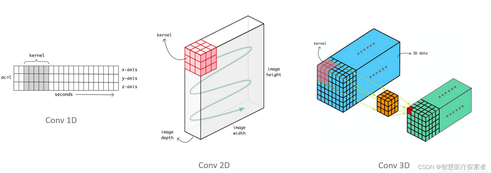

## Convolution 

### **关键词:** 
- DeepLearning
- Algorithm
- Matrix-Compute

### **摘要:** 
卷积、旋积或褶积是通过两个函数f和g生成第三个函数的一种数学运算，其本质是一种特殊的积分变换，表征函数f与g经过翻转和平移的重叠部分函数值乘积对重叠长度的积分

### **情形**

1.  **Math** 

- 图像卷积公式
$$
O[c_{out}, h_{out}, w_{out}] = \sum_{c_{in}=0}^{C_{in}-1} \sum_{i=0}^{K_h - 1} \sum_{j=0}^{K_w - 1} K[c_{out}, c_{in}, i, j] \cdot I[c_{in}, h_{out} \cdot s_h + i, w_{out} \cdot s_w + j] + b[c_{out}]
$$
其中$K$为$K_h X K_w$的卷积核, $c_{out}$为输出的维度(通道), $c_{in}$为输入的维度(通道), $s_{h}$和$s_{w}$分别为垂直和水平方向的stride(步长)

- 连续卷积公式: 对两个连续函数进行的一种积分运算，用于描述一个函数经过某种线性时不变系统后的输出。
$$
h(t)=(f*g)(t)=\int_{-\infty}^{\infty}f(\tau)g(t - \tau)d\tau
$$
将g(t)进行翻转和平移，然后与f(t)相乘并在整个时间轴上积分，得到的结果h(t)反映了两个函数在不同时刻的重叠程度。

- 离散卷积: 离散卷积是针对离散序列进行的运算
$$
y[n]=(x*h)[n]=\sum_{k = -\infty}^{\infty}x[k]h[n - k]
$$
将h[n]进行翻转和平移，然后与x[n]对应元素相乘并求和

2. **Pytorch Convolusion**
卷积核在输入信号(图像)上滑动，相应位置上进行乘加。


$$
Input: (N, C_{in}, L_{in}) \\
Output: (N, C_{out}, L_{out}) \quad where \\
L_{out} = \left\lfloor\frac{L_{in} + 2 \cdot padding - dilation \cdot (kernel\_size - 1)}{stride} + 1\right\rfloor
$$

$I(H_{in} X W_{in}) \rightarrow O((H_{in} - K + 1) X (W_{in} - K + 1))$

```Python
torch.nn.Conv2d(in_channels, out_channels, kernel_size, stride=1, padding=0, dilation=1, groups=1, bias=True, padding_mode='zeros')
```

<details>
    <summary>params</summary>
        <ul>
	      <li><strong>kernel_size</strong>：一个整数（表示正方形卷积核），也可以是一个元组 (h, w) 分别表示卷积核的高度和宽度</li>
          <li><strong>stride</strong>: 默认值为 1。可以是一个整数，也可以是一个元组 (stride_h, stride_w) 分别表示垂直和水平方向的步长. 较大的步长会使卷积核跳过更多的像素，从而减少输出特征图的尺寸。当 stride = 2 时，输出特征图的尺寸大约会变为输入特征图尺寸的一半。</li>
          <li><strong>padding</strong>: 一个整数，表示在图像四周添加相同数量的像素；也可以是一个元组 (padding_h, padding_w) 分别表示垂直和水平方向的填充量. 常用的填充值为 0，即 padding_mode='zeros'</li>
          <li><strong>dilation</strong>: 控制卷积核中元素之间的间距。默认值为 1. 可以是一个整数，也可以是一个元组 (dilation_h, dilation_w) 分别表示垂直和水平方向的膨胀率. 捕捉全局特征, 较大的 dilation 值会使卷积核的感受野增大，即卷积核可以覆盖到更大范围的输入图像</li>
        </ul>
</details>

<details>
    <summary>attention</summary>
        <ul>
            <li><strong>stride=2</strong>: 由于 H = W = 15, kernel_size=3, padding=1, stride=2, 输出尺寸 = (15 + 2*1 - 3) / 2 + 1 = 8.5 → 取整后为8(丢失0.5像素的信息) 因此需要对图片填充 padding = (stride * (H_in(==W) - 1) - H_out(==W_out) + kernel_size) / 2</li>
        </ul>
</details>

```Python
conv_same = nn.Conv2d(32, 64, kernel_size=3, stride=2, padding='same')  # PyTorch 1.9+支持
x_odd = torch.randn(1, 32, 15, 15)
print(f"自适应填充输出: {conv_same(x_odd).shape}")  # 自动计算padding

# 方案2：手动填充
pad = nn.ZeroPad2d((0, 1, 0, 1))  # 右侧和底部各填充1像素
x_padded = pad(x_odd)
print(f"填充后输出: {conv2(x_padded).shape}")  # [1, 64, 8, 8]
```
