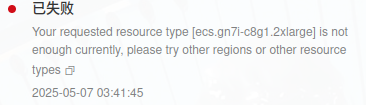

##  PPO Algorithm

### 关键词: 
- PPO
- RL

### 摘要: 
PPO 是一中RLHF算法, 为一种 actor-critic 结构的策略梯度算法. 其特点在于裁剪机制.

### 情形:
1. actor-critic 结构

由--reward_model_path 和 --

    
补充

        <ul>
	      <li><strong>.</strong>： .</li>
        </ul>

