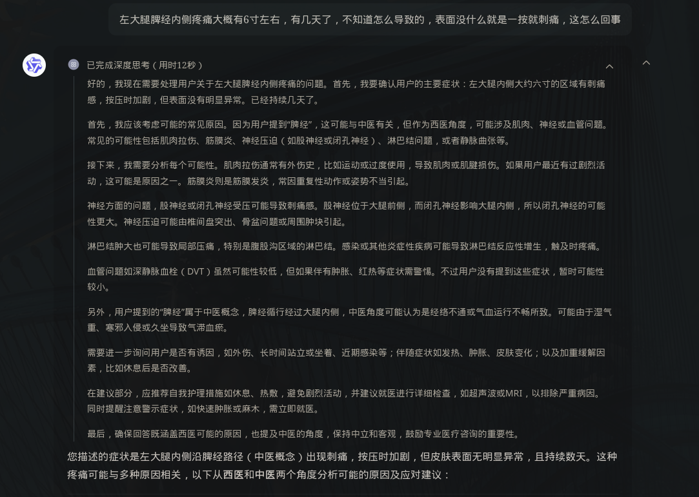
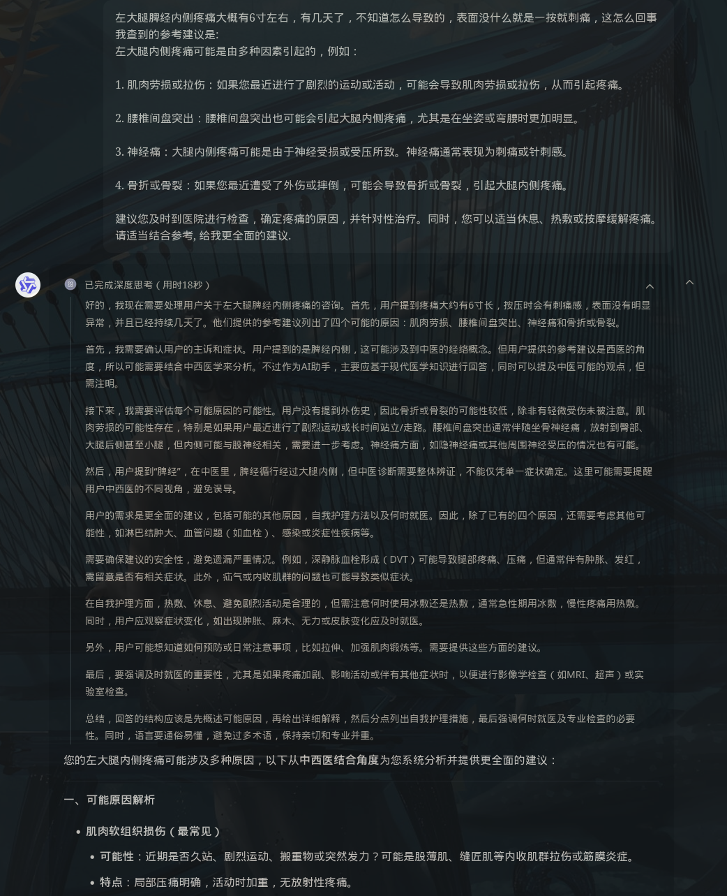
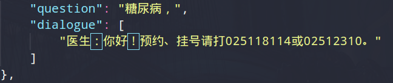

##  Qwen3推理模式和非推理模式

### 关键词: 
- Qwen3

### 摘要: 


### 情形:

1. Qwen3 API接口函数

```Python
    from openai import OpenAI
import os

# 初始化OpenAI客户端
client = OpenAI(
    # 如果没有配置环境变量，请用百炼API Key替换：api_key="sk-xxx"
    api_key=os.getenv("DASHSCOPE_API_KEY"),
    base_url="https://dashscope.aliyuncs.com/compatible-mode/v1",
)

messages = [{"role": "user", "content": "你是谁"}]

completion = client.chat.completions.create(
    model="qwen-plus-2025-04-28",  # 您可以按需更换为其它深度思考模型
    messages=messages,
    # enable_thinking 参数开启思考过程，QwQ 与 DeepSeek-R1 模型总会进行思考，不支持该参数
    extra_body={"enable_thinking": True},
    stream=True,
    # stream_options={
    #     "include_usage": True
    # },
)

reasoning_content = ""  # 完整思考过程
answer_content = ""  # 完整回复
is_answering = False  # 是否进入回复阶段
print("\n" + "=" * 20 + "思考过程" + "=" * 20 + "\n")

for chunk in completion:
    if not chunk.choices:
        print("\nUsage:")
        print(chunk.usage)
        continue

    delta = chunk.choices[0].delta

    # 只收集思考内容
    if hasattr(delta, "reasoning_content") and delta.reasoning_content is not None:
        if not is_answering:
            print(delta.reasoning_content, end="", flush=True)
        reasoning_content += delta.reasoning_content

    # 收到content，开始进行回复
    if hasattr(delta, "content") and delta.content:
        if not is_answering:
            print("\n" + "=" * 20 + "完整回复" + "=" * 20 + "\n")
            is_answering = True
        print(delta.content, end="", flush=True)
        answer_content += delta.content
```

- Qwen3为因果模型, 根据kv_cache缓存的token预测下一个token, 因此启动 enable_thinking 会影响 kv_cache 中的缓存大小, 不改变Qwen3本身的浮点数计算(bot 后大概率是 thinking_token), 因此第一个想法是不改变Qwen3原本的输出范式下, 注入原先不足的医疗知识. 

- 无 think 回复-> think 回复: 将原本的 QA dataset 输入给 Qwen3-4B 获取 think, 这里有个问题, think 内容会不会与 answer 内容偏差太大? --> 将答案和问题一起输入? 

无参考输入的结果:


问题与参考一起输入的结果:



2. MedDiague数据集中的问题数据



<details>
    <summary>补充</summary>
        <ul>
	      <li><strong>.</strong>： .</li>
        </ul>
</details>

