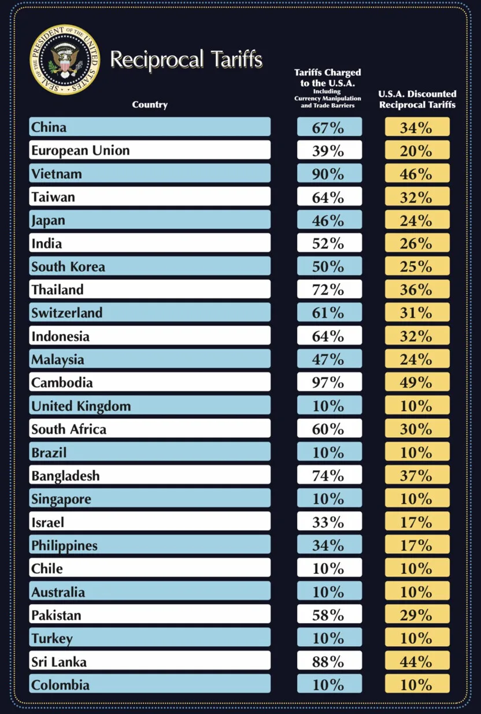
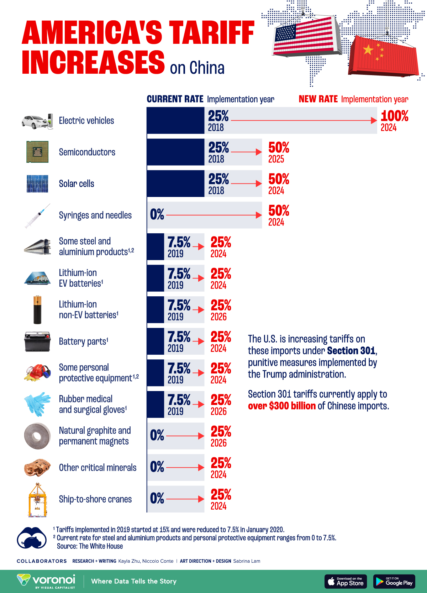

##  April

### **关键词:** 
中美  关税  见闻

### **摘要:** 
Donald John Trump 上任给各国征加关税，逆全球化; 一个未知姓名的英语老师比大部分学生都更年轻

### **情形**

1.  **关税战** 

美对各国征加关税

come from CNBC[https://www.cnbc.com/2025/04/02/trump-reciprocal-tariffs-countries-chart-imports-united-states.html]

中国，暂无图片，但是实习对等关税政策总体关税水平也到达 34%

- 简单思考： 大一经济学中关税最终作用于商品短期内由人民买单，美对中关税提升的商品主要为新能源产业 + 工业零件 + 生活用品

显而易见会对生活产生影响，而中对美关税直接提高科技品的价格？

come from 2024 拜登执政时期关税[https://www.visualcapitalist.com/comparing-new-and-current-u-s-tariffs-on-chinese-imports/]


2. **听力课**
Man Teather
- 不要固步自封，保持对新事物的好奇

- 说和做一样，直接


```bash
  .
```

<details>
    <summary>补充</summary>
        <ul>
	      <li><strong>.</strong>： .</li>
        </ul>
</details>

