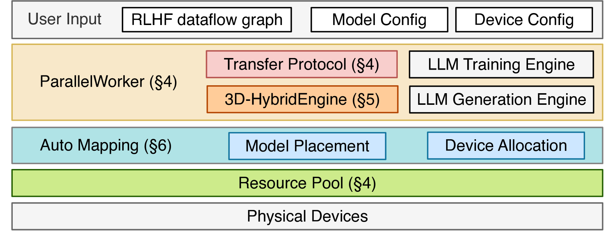
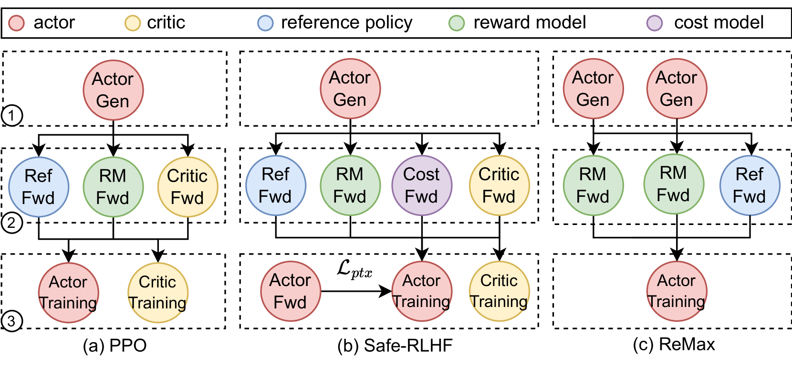

##  verl

### 关键词: 
- RL
- Architecture

### 摘要: 
创新点:

1. HybridFlow 架构: 混合单控制器(Single-controller)和多控制器(Multi-controller)实现 RLHF 数据流的高效IO和控制. 

2. Hybrid engine: 将不同的 engine 放置在同一个GPU资源组, 实现高效通信.

3. 
### 情形:
1. HybridFlow architecture

- 背景:

Single-Controller vs Multi-Controller

Single-Controller: 一个主模块负责控制逻辑, 其余子模块负责执行操作. 在RLHF的频繁数据操作和指令切换的场景下, 通讯压力过大而效率低下.

Multi-Controller: 多个模块负责管理不同的子模块, 每个子模块仍然负执行操作. 鲁棒性强, 但设计难度大.

| Single-Controller | Multi-Controller |
|-----|-----|
| 设计简单, 效率低 | 设计困难, 效率高 |
| openjdk | 17-jdk-alpine |

2, 3D-HybridEngine

图片分为三个阶段, ①阶段: Actor 生成, ②阶段: Ref RM Critic 向前传播(数据准备 prefill), ③阶段: Actor Critic 训练.

值得注意的是: Actor 在整个流程中需要两个 engine, training engine 和 rollout engine. training engine 为正常前向传播过程, rollout engine 是专门为模型推理设计的推理引擎(如 vllm, SGLang), 在推理速度上更快, 但生成的精度下降. 因此 training engine 在生成和验证时加速推理(如①阶段..), rollout engine 在③阶段更新 actor 梯度.

critic 使用 training engine 和 inference engine 为同一个 engine, 生成高精度的值.

ref model 和 reward model 只需要 inference, 使用 training engine 得到高精度的 log probs 和 reward.

    
补充

        <ul>
	      <li>collocate 策略: 将 actor 的 training engine 和 reference 的 inference engine 放置在同一个资源组上，将 critic 的 training/inference engine 和 reward 的 inference engine 放置在同一个资源组上，最后单独放置 actor 的 rollout engine.</li>
        </ul>

简单来说, 
将 actor 的 rollout engine 和 training engine 放在同一个资源组 的策略为 Hybrid engine. 

- 细节:

    
3D

        <ul>
            深度学习模型分布式训练中, 模型的参数和数据量过大, 主流的解决方案: 3D并行.
            <li>
            DP: (Data Parallelism) 数据并行, 分发不同 batch 的数据到不同设备
            </li>
            <li>
            TP: (Tensor Parallelism) 张量并行, 分发模型参数.
            </li> 
            <li>
            PP: (Pipline Parallelism) 流水线并行, 分发不同的模型
            </li>
        </ul>

HybridEngine Workflow
<image>

并行组合(Parallel Groups): 一般方法根据引擎生成精度对GPU资源分组, 就会出现将 actor 的 training engine 和 rollout engine 划分到不同的GPU资源组中, 在训练过程的 PiPline 中, 增大了通信和访存的开销, 因而将Actor training engine 和 rollout engine(generation) 放置到一个GPU资源组中.

零冗余模型切片(Zero redundancy model resharding): 由于不同的引擎的并行策略不同, 导致两个策略的参数更新时, 需要对 actor 的参数裁剪(resharding), 增加了通信和存储开销. 因而通过 Zero ... 策略, 动态参数分组, 降低通信和显存的冗余. 

3. Auto-Mapping alogrithm

- 通过自动设备映射算法识别最优的数据流到设备的映射, 自动化分发数据和模型切片.

