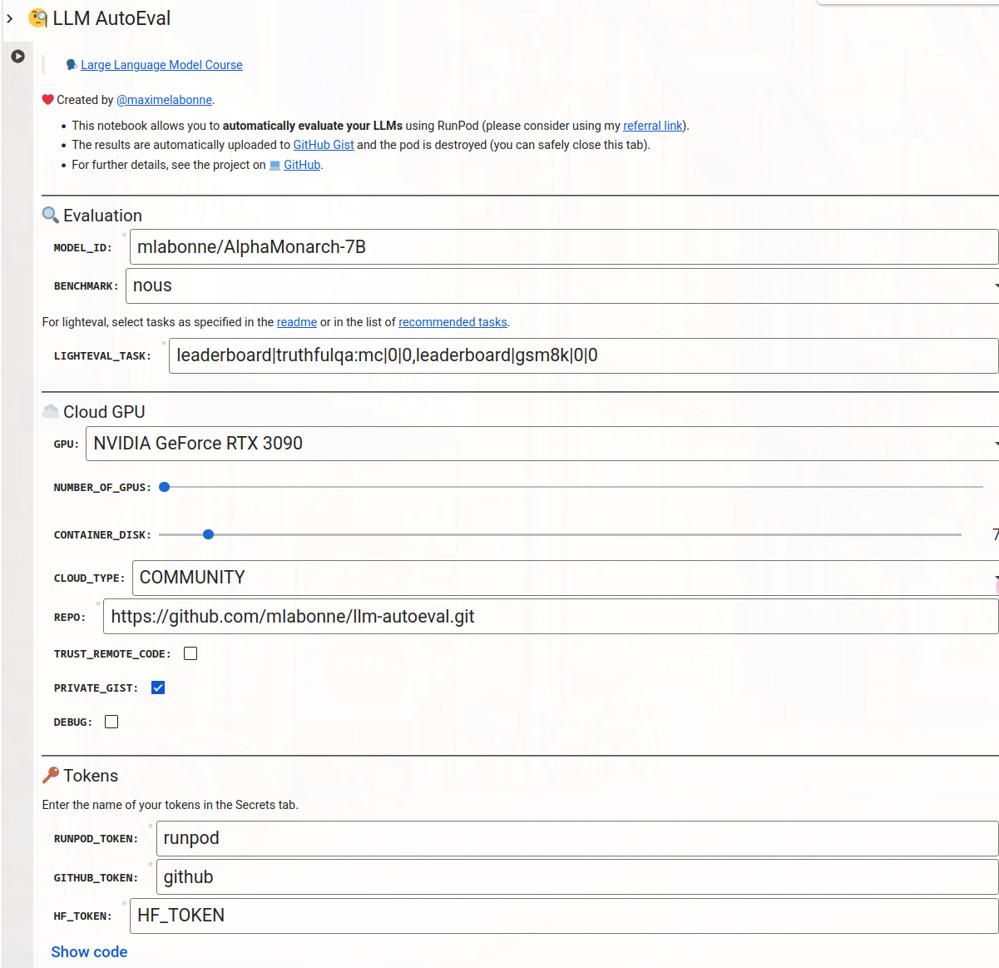

##  Eval_Method

### **关键词:** 
- Alignment Eval
- LLM
- RL

### **摘要:** 
模型的评估手段
- LLM_AutoEval: 通过 AGIEval, GPT4ALL, TruthfulQA, Bigbench 数据集合对模型进行自动化的测评 

### **LLM_AutoEval** 

- MODEL_ID ：输入 Hugging Face 的模型 ID.
- nous ：任务列表：AGIEval、GPT4ALL、TruthfulQA 和 Bigbench

    
补充

        <ul>
	      <li><strong>AGIEval</strong>： 数据集, 标准化测试AI的人类水平认知能力</li>
          <li><strong>TruthfulQA</strong>: 数据集, 专门设计用于测试模型区分真假陈述的能力的问题数据集</li>
          <li><strong>BIG-Bench</strong>: 数据集, 包含许多不同的数据集 （或以数据集形式呈现的任务）。一个包含众多独立评估数据集的基准测试套件</li>
          <li><strong>GPT4ALL</strong>: 一个开源生态系统, 可下载的预训练语言模型权重： 这些是语言模型的实际参数，用于生成文本. 软件和工具： 这些工具允许用户在本地机器上下载、运行和与这些语言模型交互.</li>
        </ul>

- lighteval ：这是 Hugging Face 的一个新库 。它允许您指定自述文件中所示的任务。查看推荐任务列表，了解您可以使用哪些任务（例如 HELM、PIQA、GSM8K、MATH 等）

- openllm ：任务列表：ARC、HellaSwag、MMLU、Winogrande、GSM8K 和 TruthfulQA（例如 Open LLM Leaderboard ）。它使用 vllm 实现来提升速度

- RUNPOD_TOKEN ：如果您还没有账户，请考虑使用我的推荐链接 。您可以在这里的 “API 密钥”（读写权限）下创建您的令牌。您还需要在那里转账一些资金来启动一个 Pod.

- GITHUB_TOKEN ：您可以在此处创建您的令牌（读写，仅限于“gist”）

- HF_TOKEN ：可选。如果您有账户

[AGIEval](https://github.com/ruixiangcui/AGIEval?tab=readme-ov-file)

[TruthfulQA](https://github.com/sylinrl/TruthfulQA)

[BIG-bench](https://github.com/google/BIG-bench)
