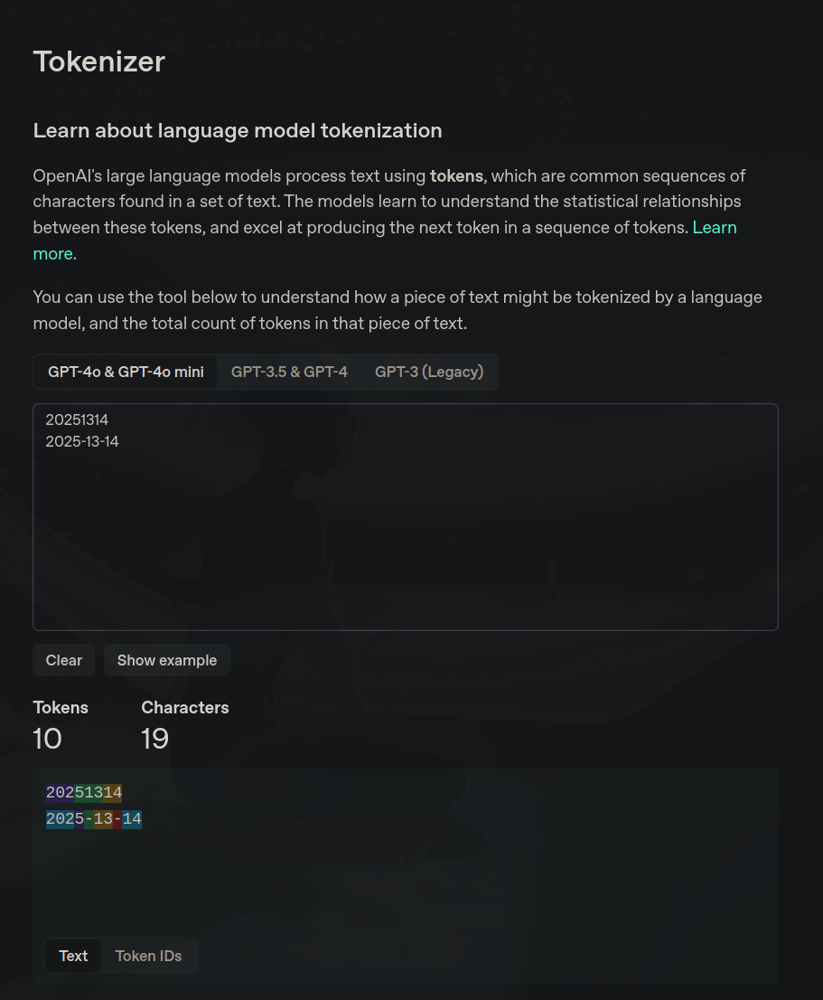

## 就矩阵相乘的方法与探索

### **关键词:** 
高效计算  矩阵  纠错

### **摘要:** 
背景： 计算前向相似度与后向相似度问题时，考虑如何提升专利文本中主要特征问题的深究

结论： 
  1. bert 输出的 token 会因微小变化而产生微小变化
  2. embedding[:1] @ embedding[1:].T 方法通过切片方法，计算 embedding_1 和 embedding_2, ..., embedding_n 的相似度

### **情形**

1.  **bert 输出变化** .

```Python
text_emb: tensor([[[-4.1373e-01, -1.2438e+00,  1.5378e-01, -1.1579e+00, -7.9292e-01,
           1.8889e+00,  2.9785e+00,  5.5411e-03, -8.4802e-01, -1.1034e+00,
           1.6795e+00, -7.2899e-01, -5.2490e+00,  4.8378e+00,  1.2198e+00,
           7.9393e+00, -2.0574e+00,  4.0021e+00,  2.6849e+00, -3.7236e-01,
          -1.5334e+00, -5.3770e-01, -2.0343e+00, -8.3301e-01,  2.9260e-01,
          -8.8318e-01, -2.9889e+00,  2.7417e+00, -3.3803e+00,  5.6091e+00],],
          ...])
topic_emb: tensor([[[-4.4668e-01, -1.3143e+00,  2.1402e-01, -1.0709e+00, -7.3929e-01,
           1.8742e+00,  2.9563e+00,  3.5111e-02, -8.4169e-01, -1.1291e+00,
           1.7663e+00, -7.2882e-01, -5.3450e+00,  4.8506e+00,  1.2340e+00,
           8.0611e+00, -2.0794e+00,  4.0263e+00,  2.8214e+00, -3.7010e-01,
          -1.5477e+00, -5.0957e-01, -2.1064e+00, -8.8533e-01,  2.7092e-01,
          -8.6033e-01, -3.0441e+00,  2.8044e+00, -3.4526e+00,  5.6518e+00],],
          ...])
```
- 可以观察到对于句式改变( 如： 小狗呢 和 小狗呢？ )后 tokens-embedding 发生了细微变化，但 vector 的方向和大小的变化近忽略不计
- 但是这样就无法简单使用对应 tokens-embedding 相等进行语义特征强化了

2. **切片方法应用**

Method
```Python
embeddings[:1] @ embeddings[1:].T
```

Phenomenon
```Python
# Input
embeddings = np.array([
    [0.8, 0.6],  # Embedding 1
    [0.9, 0.4],  # Embedding 2
    [0.1, 0.9],  # Embedding 3
    [0.5, 0.5]   # Embedding 4
])

# Output
__main__ | x.calculate_similarity:132 | [:1]: [[0.8 0.6]]
__main__ | x.calculate_similarity:133 | [1:]: 
[[0.9 0.4]
 [0.1 0.9]
 [0.5 0.5]]
__main__ | x.<module>:155 | simlarity: [[0.96 0.62 0.7 ]]
```
- 可以看到切片的变化
- 可以通过迭代 Embedding 1 和 Embeddinbg 2 ... n 实现计算相似度高效计算

3. **补充**
tokenizer 更改时间规则
